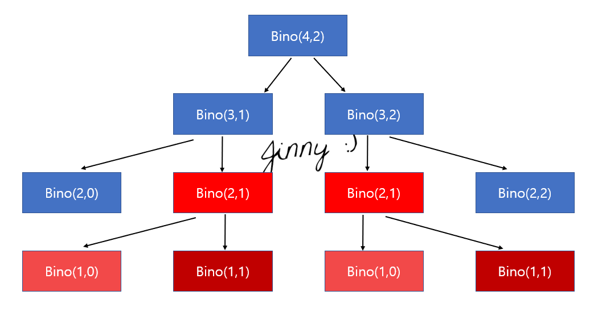

# DP(Dynamic Programming)

### :smile:동적 계획법 알고리즘 : 주어진 문제를 더 작은 문제들로 나눈 뒤 작은 조각들로부터 답을 계산하고, 이 답들로부터 원래 문제의 답을 계산해 내는 알고리즘

- 동적계획법 VS 분할 정복

  - 동적 계획법 : 작은 조각이 반복된다. (같은 계산을 하는 조각들로 나눔) -> 중복된 계산을 하지않기 위해 **memoization** 이용

  - 분할 정복 : 작은 조각들이 같은 계산을 하지 않는다. (서로 독립적)

- 동적계획법 알고리즘

  - 이항계수 $ \binom{n}{r} $

    : 서로 다른 원소 중에서 r개의 원소를 순서없이 골라내는 방법의 수

  $$
  \binom{n}{r} = \binom{n-1}{r-1} + \binom{n-1}{r}
  $$
  
  이 식은 다음과 같이 코드로 짤 수 있다.
  
  ```c
  int bino(int n, int r){
      //n개중에 n개를 뽑는 경우는 1가지, n개중에 0개를 고르는 경우도 1가지이다.
      if(r==0 || n==r) return 1;
      return bino(n-1, r-1) + bino(n-1,r);
  }
  ```
  
  
  
  함수 호출을 표현하면 이렇게 나오는데 bino(2,1)과 bino(1,1), bino(1,0)에서 함수호출이 두번씩 된다는 것을 볼 수 있다. 예시에서 n은 4이기에 이렇게 조금만 중복되지만 n과 r이 커짐에 따라 중복 호출 수는 기하급수적으로 증가한다. 따라서 메모이제이션이 필요하다.
  
  ##### 메모이제이션 : 함수의 결과값을 저장하는 배열을 만들고 한번 계산한 값은 저장했다가 재활용하는 최적화 기법 
  
  ```c
  // -1로 초기화한다. int cache[n][r] = nCr(n개중에서 순서없이 r개를 고름)의 값이 들어감
  int cache[30][30];
  int bino2(int n, int r){
      if(r==0 || n==r) return 1;
      if(cache[n][r] != -1)//계산이 한번이라도 된경우 -1이 아님
          return cache[n][r];
      return cache[n][r]=bino2(n-1, r-1) + bino2(n-1,r);
  }
  ```
  
  그럼 실제 문제에 적용을 해보자
  
  - 백준 2579 **계단 오르기**	[문제 링크](https://www.acmicpc.net/problem/2579)
  
    ### 문제설명 
  
    각 점수를 가진 계단을 밟고 꼭대기까지 올라간다. 꼭대기에 도착했을때 최댓값을 가지도록 하는 문제인데 계단 오르는 데는 다음과 같은 규칙이 있다.
    
    1. 계단은 한번에 한 계단씩 또는 두 계단씩 오를 수 있다.
    2. 연속된 세 개의 계단을 모두 밟아서는 안된다. 단, 시작점은 계단에 포함되지 않는다.
    3. 마지막 도착 계단은 반드시 밟아야 한다.
    
    ### 입력
    
    첫째 줄에 계단의 개수
    
    둘째 줄부터 계단의 개수만큼 계단의 점수가 주어짐
    
    (계단 갯수 $\leq$ 300, 점수 $\leq$ 10,000)
    
    ### 출력
    
    계단 오르기 게임에서 얻을 수 있는 총 점수의 최댓값
    
    ### 아이디어
    
    먼저 계단값을 가지는 int stairs[300] 배열과 각 계단의 위치에서 최댓값을 가지는 DP[300] 배열을 만들어 주었다. 
    
    | 10   | 20   | 15   | 25   | 10   | 20   |
    | ---- | ---- | ---- | ---- | ---- | ---- |
    |      |      |      |      |      |      |
    
    > 표에서 윗 부분은 stairs를 나타내고, 아래 부분은 DP라고 하자
    
    다음과 같은 예시가 주어졌을때, 첫 계단까지 오르는데 최댓값은 당연히 10 ($ staris[0]$ )이다.
    
    | 10   [0] | 20   [1] | 15   [2] | 25   [3] | 10   [4] | 20   [5] |
    | -------- | -------- | -------- | -------- | -------- | -------- |
    | 10       |          |          |          |          |          |
    
    DP[1]의 값은 두번째 계단까지 갔을때 최댓값 이므로 $ stairs[0]+stairs[1] $ 이 된다. 
    
    | 10   [0] | 20   [1] | 15   [2] | 25   [3] | 10   [4] | 20   [5] |
    | -------- | -------- | -------- | -------- | -------- | -------- |
    | 10       | 30       |          |          |          |          |
    
    DP[2]의 경우 __계단은 연속으로 세번 밟을 수 없기 때문에__ $ max(stairs[0]+stairs[2], stairs[1]+staris[2]) $ 가 된다. 
    
    이경우 35 (20+15) 가 된다.
    
    | 10   [0] | 20   [1] | 15   [2] | 25   [3] | 10   [4] | 20   [5] |
    | -------- | -------- | -------- | -------- | -------- | -------- |
    | 10       | 30       | 35       |          |          |          |
    
    DP[3]부터 조금 생각해야 하는데, 두가지 경우로 나뉜다. 
    
    바로 전 계단을 밟는 경우 
    $$
    stairs[2]+DP[0]+stairs[3]
    $$
    
    
    전전 계단을 밟는 경우
    $$
    DP[1]+stairs[3]
    $$
    바로 전 계단까지의 최댓값은 이미 연속으로 두계단을 밟은 상태이기 때문에 DP에 저장된 값을 이용하지 못하고 계단값만 더하는거고, 그전전 계단은 연속으로 몇번을 밟았던 두칸뛰어서 새로운 계단을 밟는것이기 때문에 그냥 더할 수 있다.
    
    이경우 55(30+25) 가 된다.
    
    | 10   [0] | 20   [1] | 15   [2] | 25   [3] | 10   [4] | 20   [5] |
    | -------- | -------- | -------- | -------- | -------- | -------- |
    | 10       | 30       | 35       | 55       |          |          |
    
    마찬가지로
    $$
    DP[4] = max(stairs[3]+DP[1]+stairs[4] , 
    		DP[2]+stairs[4])
    $$
    이경우 65(55+30+10)이 된다.
    
    | 10   [0] | 20   [1] | 15   [2] | 25   [3] | 10   [4] | 20   [5] |
    | -------- | -------- | -------- | -------- | -------- | -------- |
    | 10       | 30       | 35       | 55       | 65       |          |
    
    마지막 DP[5]도 같은 방식으로 구한다.
    $$
    DP[5] = max(stairs[4]+DP[2]+stairs[5] , 
    		DP[3]+stairs[5])
    $$
    
    
    | 10   [0] | 20   [1] | 15   [2] | 25   [3] | 10   [4] | 20   [5] |
    | -------- | -------- | -------- | -------- | -------- | -------- |
    | 10       | 30       | 35       | 55       | 65       | 75       |
    
    그러면 공식이 하나 보이는데
    $$
    DP[n] = max(stairs[n-1]+DP[n-3]+stairs[n], DP[n-2]+stairs[n])
    $$
    이렇게 표현할 수 있다. 
    
    마지막 계단은 꼭! 밟아야 하기 때문에 DP[n-1]을 출력하면 되는 문제! (index는 0부터 시작)
    
    
    
    이것을 코드로 짠 것은 `Problem solving` >> `BOJ2579`에 올려놨다.