# 최소 스패닝 트리(MST) - Kruskal's Algorithm(크루스칼 알고리즘)

Spanning Tree란 그래프 내의 모든 정점을 포함하는 트리를 말한다.

최소스패닝트리(MST)는 스패닝 트리에서 사용된 간선들의 가중치의 합이 최소인 트리를 말하는데, 

그 중 크루스칼 알고리즘은 **가중치가 제일 작은 간선순서대로** 모든 정점들을 싸이클을 만들지 않고 연결하는 알고리즘이다.

간선을 연결할때 사용하는 방법이 **Union-Find**방법인데, 합치고 찾는다는 뜻에서 Union, Find이다.

각 정점끼리 연결되어 있다면 같은 부모를 가진다고 생각하는거다. 그래서 초기에 각 정점들의 부모는 자기자신이고(아무것도 연결되어 있지 않으니까) 크루스칼 알고리즘이 끝났을때는 모든 정점들의 부모가 같을것이다.(모두 연결되어 있을테니까)

---

크루스칼 알고리즘을 설명하기전에 Union-Find가 어떻게 진행되는지 간단히 알아보자

초기에 그래프가 이렇게 주어졌을때(초기그래프이지만 최소경로를 구해도 똑같음)

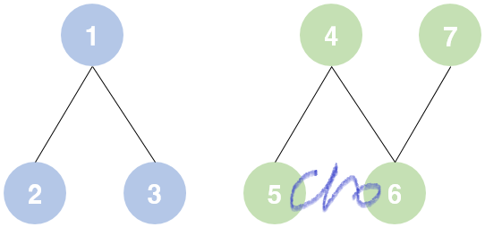

만약 아직 최소경로알고리즘을 진행하기 전이었다면 각 정점들의 부모상태는 이럴 것이다.


각 정점들은 자기자신을 부모로 가지고있다. 그리고 알고리즘이 진행된 후에

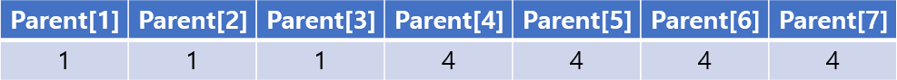

vertex 1,2,3은 서로 연결되어 있으므로 부모가 **1**, vertex 4,5,6,7끼리 서로 연결되어 있어서 부모가 **4**인것을 알 수 있다.

---

이제 크루스칼 알고리즘을 설명하겠다. 일단 초기 그래프가 이렇게 주어졌다고 하자

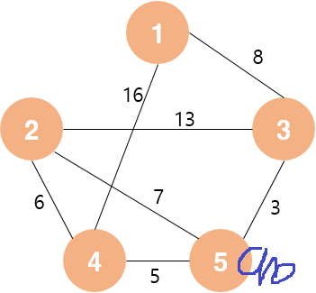

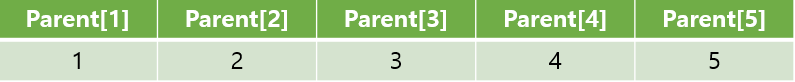

주어진 간선에서 가장 작은 가중치는 3과 5를 잇는 3이므로

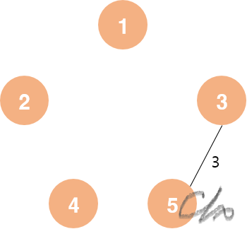

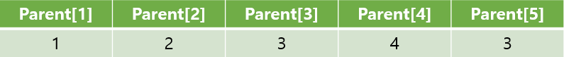

그다음은 4와5를 연결하는 5

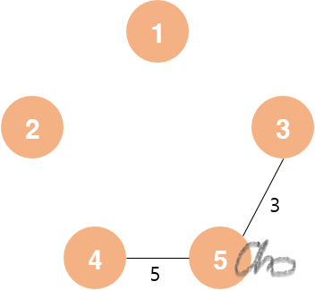

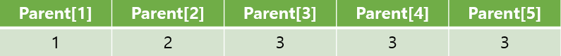

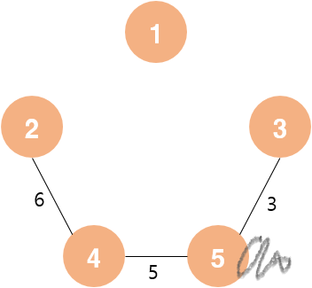

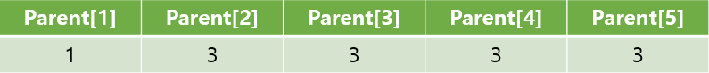

그다음으로 작은 가중치는 2와 5를 잇는 7이지만 연결하면 2-4-5 싸이클이 생기므로 연결할 수 없다.

(2의 부모와 5의 부모가 4로 같기때문에 싸이클이 생김을 알 수 있음)

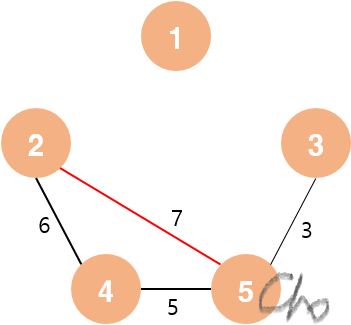

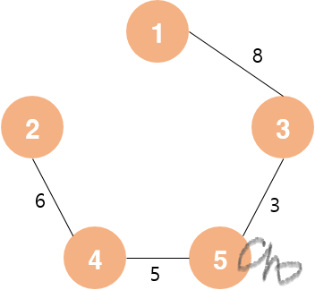

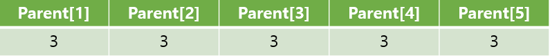

남은 간선이 있지만 모두 싸이클을 형성하므로 연결하지 않는다.

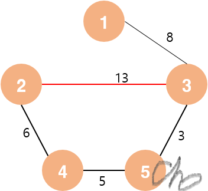

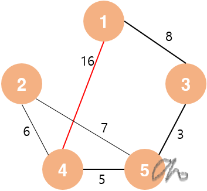

---

union-find는 세가지 함수로 구성되는데, 부모를 찾는 **getParent()**, 두 정점의 부모를 찾는 **Union**, 두개의 부모가 같은지 찾는 **Find()** 함수가 있다.

getParent는 재귀를 타고 들어가서 부모를 찾아온다. (자기자신을 부모로 가지는 정점은 더이상 타고갈 부모가 없으므로 자기자신을 부모로 가지는 정점까지 타고간다.)

```cpp
int getParent(int x) {
	if (Parent[x] == x)return x;
	else return getParent(Parent[x]);
}
```

union은 두 정점을 연결시키려고 할때 사용한다.

```cpp
int Union(int a, int b) {
	a = getParent(a);
	b = getParent(b);
	if (a < b) {
		Parent[b] = a;
		return a;
	}
	else {
		Parent[a] = b;
		return b;
	}
}
```

find는 두 정점의 부모가 같은지, (연결시켜야할지) 파악하는 함수이다.

```cpp
int Find(int a, int b) {
	a = getParent(a);
	b = getParent(b);
	if (a == b)return 1;
	else return 0;
}
```


크루스칼 알고리즘은 최소 간선우선 탐색이므로 시작전에 **무조건!** 정렬을 해주어야 한다!

대략적인 알고리즘은 이렇다.

```cpp
sort each edge;
for each v 
	//둘의 부모가 같다는것은 이미 연결되어 있다는것을 뜻함
	if Find(v1, v2) == 1 continue;
	//둘의 부모가 다르다면(연결되어 있지않다면) 부모를 합쳐준다.
	Union(v1, v2);	
```

---

위에 있는 예시를 초깃값으로 두고 만든 전체적인 소스코드이다.

graph는 간선의 가중치와, 서로 연결하는 정점 두개를 가져야 하므로, vector<pair<pair<int,int>>> 로 구성하였고,

정렬할때 가장 앞에 있는 내용으로 정렬되므로 가중치를 first에 두었다.

answer은 알고리즘이 끝난 후에 있는 간선들을 가지는 것이고(결과 확인용)

mini는 최소경로 비용을 가진다.

```cpp
#include <iostream>
#include <algorithm>
#include <vector>
using namespace std;

vector<pair<int, pair<int, int>>> graph;
vector<pair<int, pair<int, int>>> answer;
int Parent[6];

int getParent(int x) {
	if (Parent[x] == x)return x;
	else return getParent(Parent[x]);
}
int Union(int a, int b) {
	a = getParent(a);
	b = getParent(b);
	if (a < b) {
		Parent[b] = a;
		return a;
	}
	else {
		Parent[a] = b;
		return b;
	}
}
int Find(int a, int b) {
	a = getParent(a);
	b = getParent(b);
	if (a == b)return 1;
	else return 0;
}

int main() {
	int mini = 0;
	graph.push_back(make_pair(8, make_pair(1, 3)));
	graph.push_back(make_pair(16, make_pair(1, 4)));
	graph.push_back(make_pair(13, make_pair(2, 3)));
	graph.push_back(make_pair(7, make_pair(2, 5)));
	graph.push_back(make_pair(6, make_pair(2, 4)));
	graph.push_back(make_pair(3, make_pair(3, 5)));
	graph.push_back(make_pair(5, make_pair(4, 5)));
	for (int i = 1; i <= 5; i++)Parent[i] = i;

	sort(graph.begin(), graph.end());
	for (int i = 0; i < graph.size(); i++) {
		int v1, v2;
		v1 = graph[i].second.first;
		v2 = graph[i].second.second;
		//둘의 부모가 같다는것은 이미 연결되어 있다는것을 뜻함
		if (Find(v1, v2) == 1)continue;
		mini += graph[i].first;
		Union(v1, v2);
		answer.push_back(graph[i]);
	}

	cout << "최소 경로길이는: " << mini << endl;
   	cout << "=====================================\n";

	for (int i = 0; i < answer.size(); i++) {
		cout << answer[i].second.first << "와" << answer[i].second.second << "가 연결되었습니다.\n";
	}
}
```


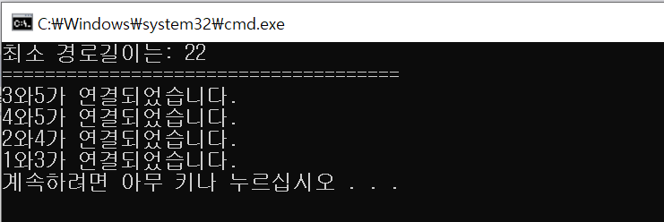